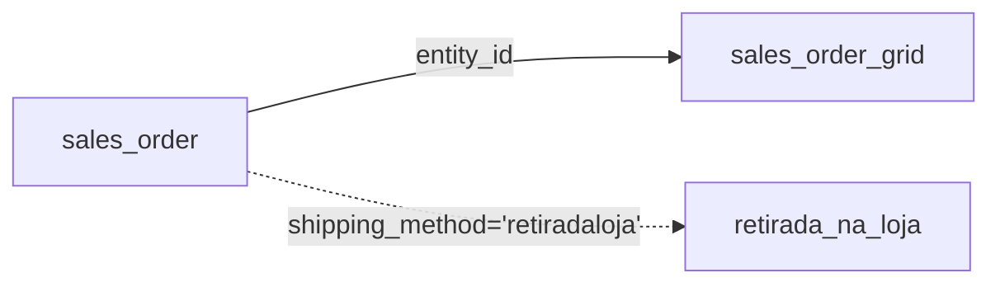

# 📦 Módulo "Retirada na Loja" para Magento 2

Módulo customizado que implementa o método de entrega "Retirada na Loja" com todas as funcionalidades requisitadas.

## 🛠️ Pré-requisitos

- Magento 2.4.x (testado na 2.4.5)
- PHP 7.4+
- MySQL 5.7+
- Acesso SSH ao servidor

## 🚀 Instalação Passo a Passo

### Método 1: Via Git Clone

```bash
# Acesse a pasta do Magento
cd </caminho/seu_magento>

# Clone o repositório
git clone https://github.com/espaker/essentia-retirada-na-loja.git app/code/Espaker/RetiradaNaLoja

# Execute os comandos necessários
php bin/magento module:enable Espaker_RetiradaNaLoja
php bin/magento setup:upgrade
php bin/magento cache:clean
php bin/magento cache:flush
<<<<<<< HEAD
```


## 📊 Modelo Relacional
=======
>>>>>>> ef9c4d8542f9caab3319b52dce49c95f672d3e11

### Estrutura do Banco de Dados
| Tabela             | Coluna Adicionada     | Tipo     | Descrição                          | Patch Responsável |
|--------------------|-----------------------|----------|------------------------------------|------------------|
| `sales_order_grid` | `retirada_na_loja`    | SMALLINT | Flag de pedido com retirada (0/1)  | `AddRetiradaNaLojaToSalesOrderGrid` |
<<<<<<< HEAD

### Relacionamentos 
<!-- Mermaid Support -->
<script src="https://cdn.jsdelivr.net/npm/mermaid/dist/mermaid.min.js"></script>

=======
>>>>>>> ef9c4d8542f9caab3319b52dce49c95f672d3e11
